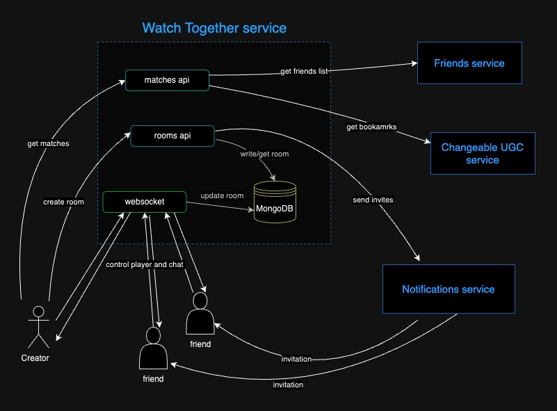

# Кино вместе

На фронте предполагается страница, проверяющая список «Хочу посмотреть» у друзей пользователя и выводящая совпадения, на ней же кнопка "начать просмотр". После нажатия кнопки начинается сеанс совместного просмотра с чатом. Также есть общий механизм управления (пауза, перемотка) контентом у всех.

# Схема архитектуры

# Запуск
Перед запуском создать .env файлы по .env.example  
Запуск проекта: `docker-compose up`  
Запуск тестов: `cd tests & docker-compose up`

## Документация 
http://127.0.0.1/api/openapi

## Разработка
* Лиана Нигматуллина - тимлид
* Татьяна Акимова - разработчик
* Софья Рытик - разработчик
* Анатолий Хабаров - разработчик
